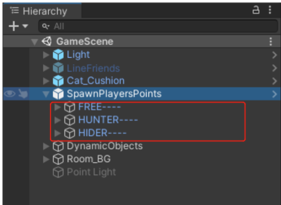
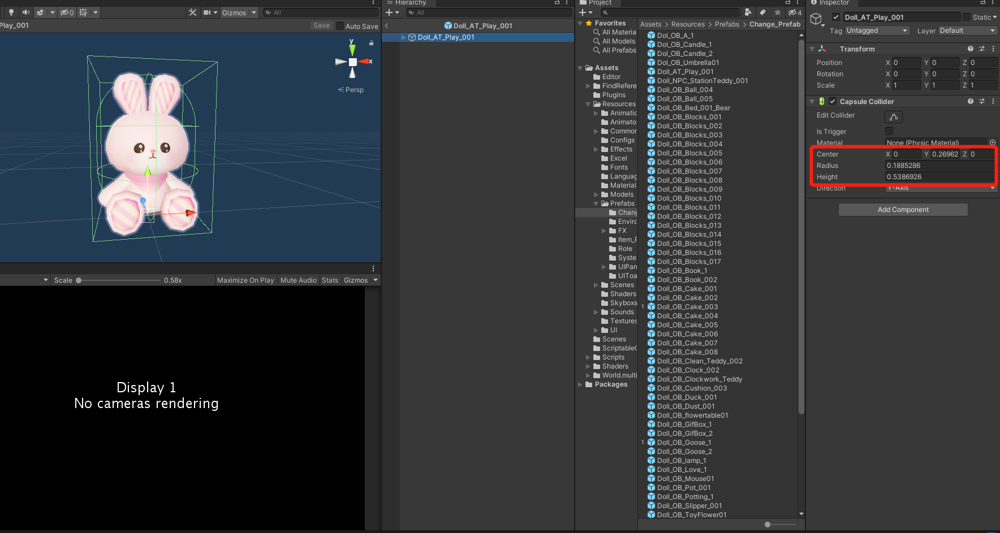

# HideAndSeek_Template

[English]()|[中文](README-CN.md)

# hideAndSeek core logic project template

## Project Description

- The project contains the core logic of peek-a-boo gameplay and a game scene (Doll's House).
The Main scene is the entry, and the GameScene is the dynamically loaded game scene. These two scenarios need to be added in a BuildingSetting.
- After running the server, you can start the game by running it directly in the Main scene.

### Project Configuration

- #### Server Configuration

The server configuration-related parameters can be changed in GAME_RULE_JSON in the ServerData.ts script

- #### Client Configuration

1. ##### Spawn Points Configuration

Under the SpawnPlayersPoints child node of the GameObject in the GameScene scene, create the initial birth point (FREE), HIDER (HIDER), and HUNTER (HUNTER).

2. ##### Dynamic random model configuration in the scene

Under the DynamicObjects node in the GameScene scene, create the scene objects that need to be displayed dynamically at random.

In MapModule.ts, set mDynamicModelTotal (total number of objects) and mRandomModelTotal (random number).

3. ##### The door to the Seeker's birth place

Is the Room_BG/Door object in the GameScene scene (name and node cannot be changed). The program will control the opening and closing of the door animation.

4. ##### The configuration of the hiding model

Can become objects of precast body in Assets/Resources/Prefabs/Change_Prefab. The parameters of the CapsuleCollider component on each preform need to be adjusted individually to control the collision of the transform model.

The Assets/Resources/Excel/ItemWeight table controls the weights of the random model. The ExcelTool table guide tool is available under the Tool option in the editor and will generate the corresponding Data model under Scripts/Data.

Assets/ScriptableObjects/ModelImage configuration transformation model of the associated icon, id need and ItemWeight table in the same order.

5. ##### Description of ConfigManager

PlayerInfo.json configures the speed and camera distance of the characters in different camps
Only the data for the default model of the role is configured in ModelInfo.json

6. ##### Multi-language configuration

Set this parameter in Assets/Scripts/Common/ZW_LOCALIZATION_Peekaboo

---

### Built-in tool description

- #### ExcelTool

ExcelTool is a tool used to generate the corresponding data model.
Under the Editor directory, there is the script for the tool.
In the Plugins directory of Excel.DLL and ICSharpCode SharpZipLib.DLL are dependent libraries.

- #### How to use ExcelTool

Open Tool/ExcelTool and select Excel that you want to export.
Set the file format to be exported, click Export to Client\Server, and the file will be generated in the corresponding path.
